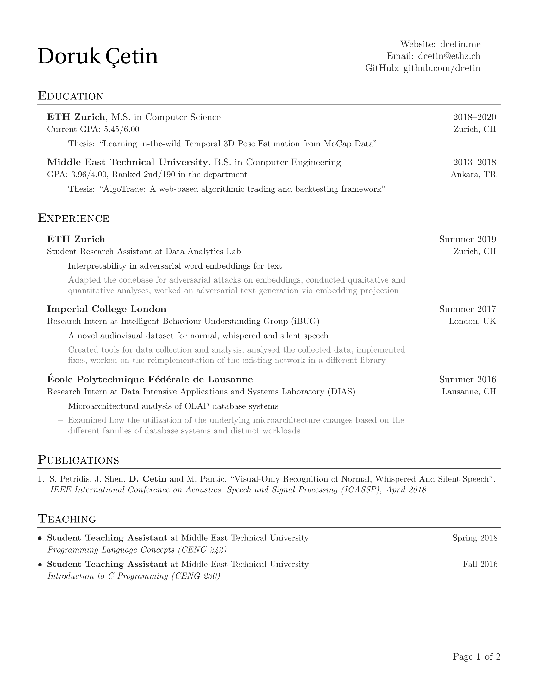
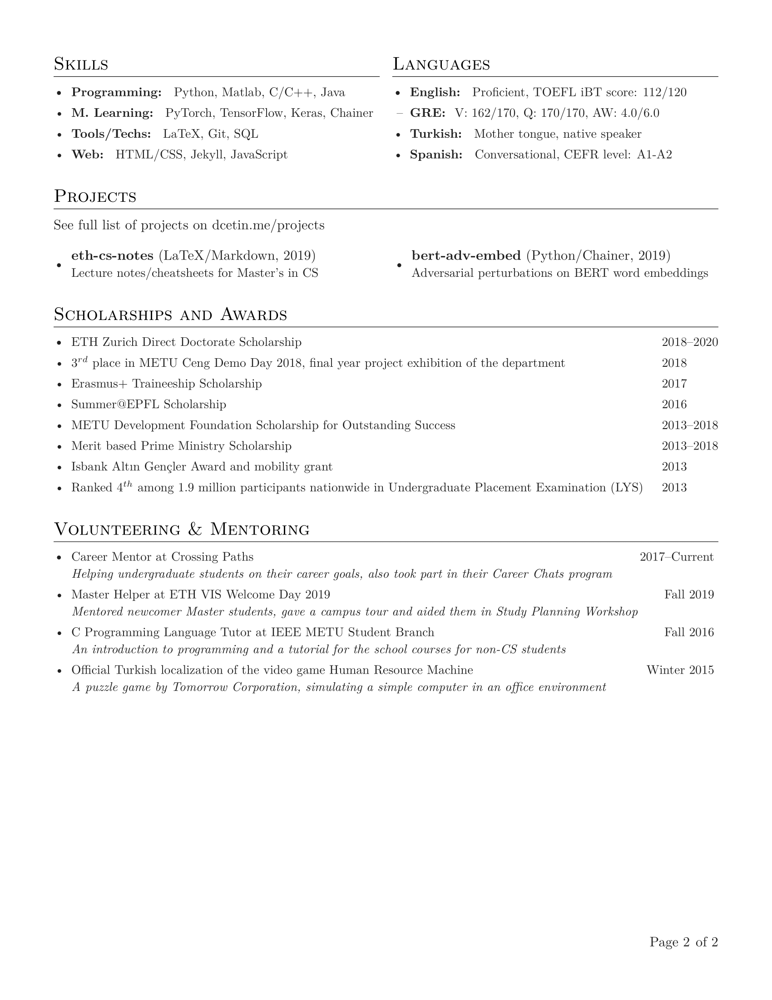
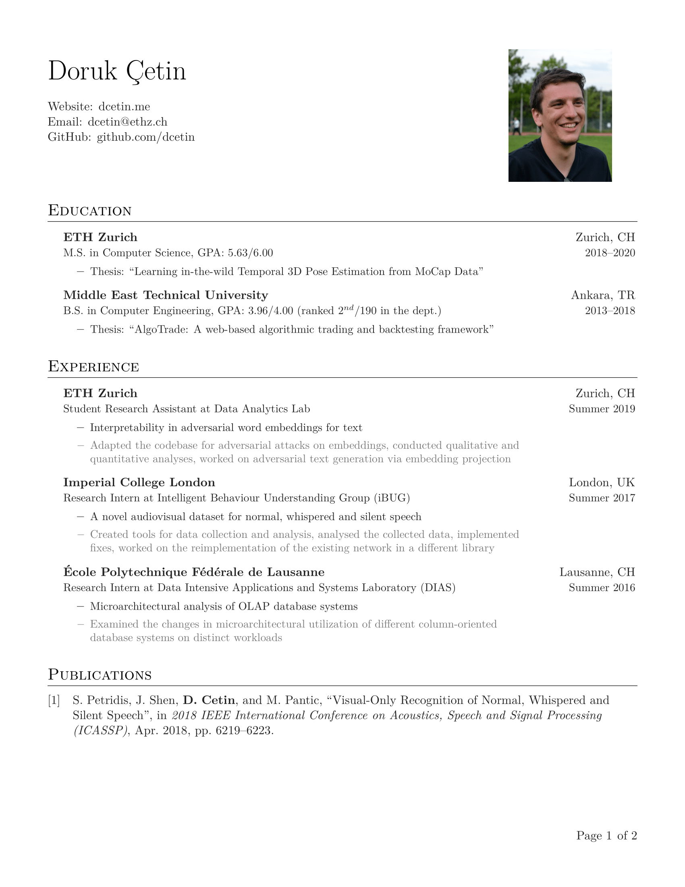
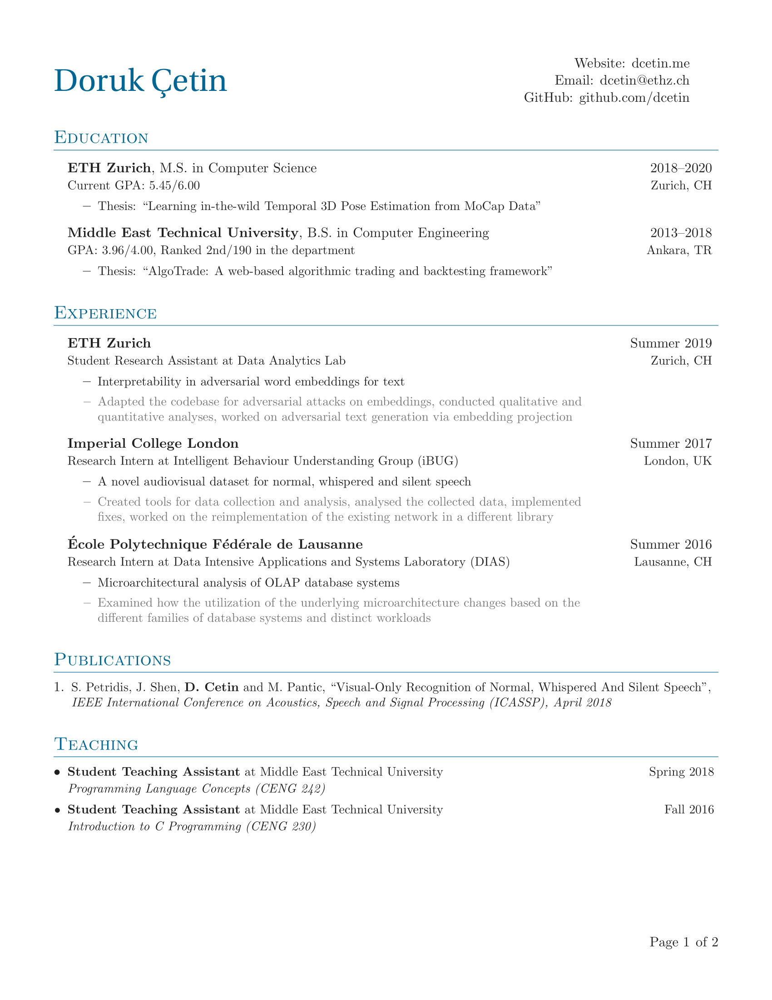
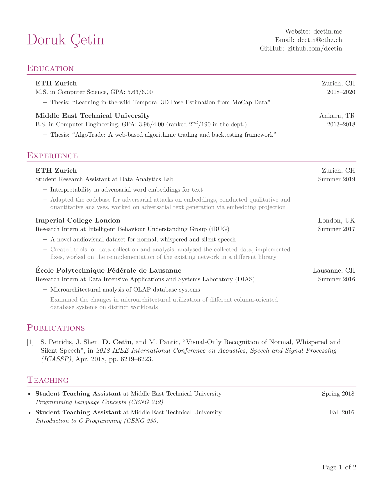

# Simple-CV

A minimalistic, multi-page CV template with BibLaTeX support. My motivation was some [general guidelines](http://dcetin.me/en/blog/how-to-write-a-good-cv) I had in mind, though the actual LaTeX template was mainly inspired by works of [Sourabh Bajaj](https://github.com/sb2nov/resume) and [Seojin Bang](https://github.com/SeojinBang/TidyCV).

## Usage

You can either fill the [basic template on Overleaf](https://www.overleaf.com/latex/templates/simple-cv/wmsyrgqwwqnc), or edit the example CV provided here.
Note that the template needs to be compiled with XeLaTeX or LuaLaTeX.
Code is tested on Windows with Texmaker/Biber/MikTeX.

To use the alternative headers just uncomment the relevant lines in the main tex file (and replace the photo with yours, if you are using `\headingphoto`). Social media icons are from fontawesome package, see [its reference](https://mirrors.ibiblio.org/CTAN/fonts/fontawesome/doc/fontawesome.pdf) for a list of all available icons.
Theme color and bibliography style can similarly be set at the top of the main tex file. See [Colors entry in LaTeX wikibooks](https://en.wikibooks.org/wiki/LaTeX/Colors) for more predefined colors.
Template also supports Chinese and Cyrillic characters, you just need uncomment the relevant lines in the preamble.

## Preview

First page                 | Second page
:-------------------------:|:-------------------------:
|

Header with photo                | Blue theme               | Red theme
:-------------------------------:|:------------------------:|:---------------------:
 ||

## License

Available under [the MIT license](https://opensource.org/licenses/MIT), but all the data is owned by me.
