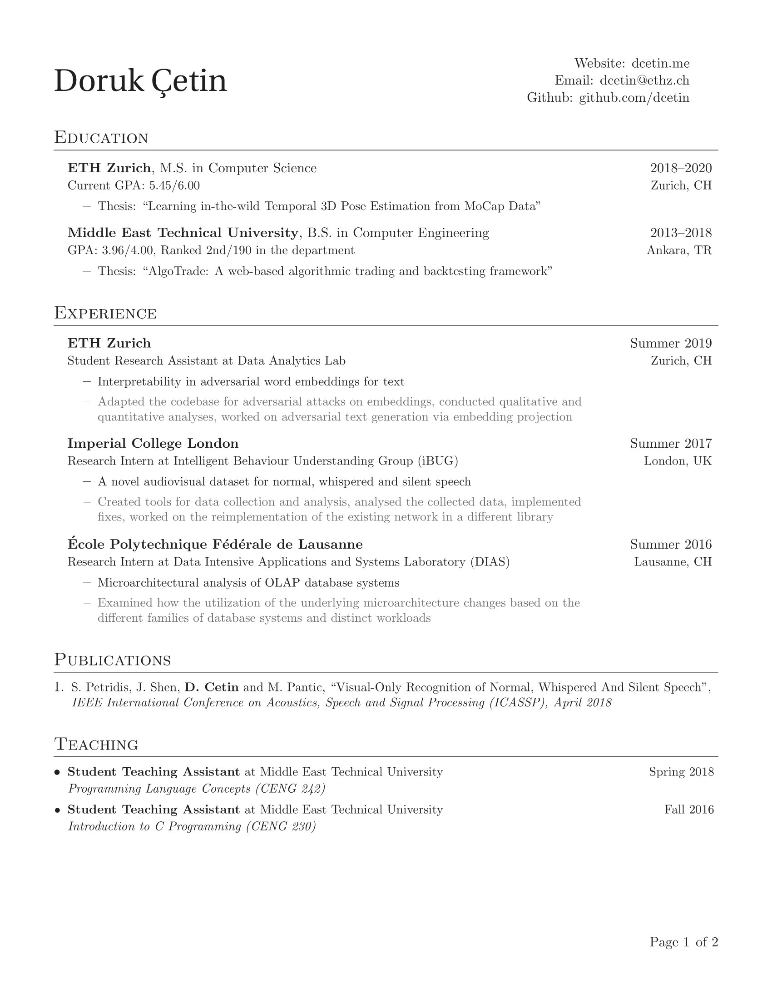
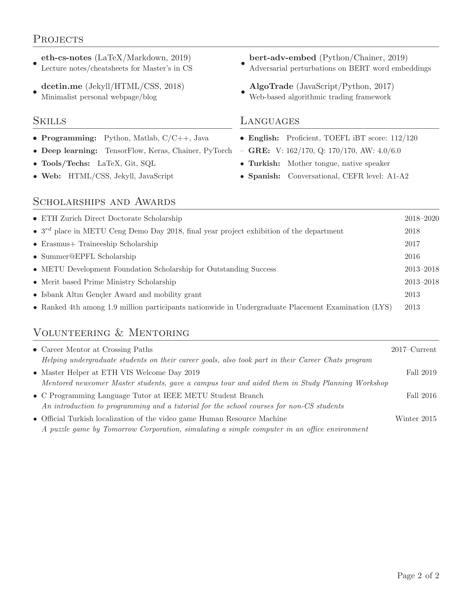

# Resume

A simple multi-page resume template. I prepared it according to some [general guidelines](http://dcetin.me/en/blog/how-to-write-a-good-cv) I had in mind. The template was originally based on [that of Sourabh Bajaj](https://github.com/sb2nov/resume), which is also worth a look.

## Preview

First page                    |  Second page
:----------------------------:|:----------------------------:
 |

## License

Available under [the MIT license](https://opensource.org/licenses/MIT), but all the data is owned by me.
